# ChatBot with Open AI and LangChain

[Main Handbook](https://inky-ironclad-8d2.notion.site/Generative-AI-Workshop-bfb0123ccf6945ebbfa5bf3328917423), [This handbook](https://inky-ironclad-8d2.notion.site/ChatBot-with-Open-AI-and-LangChain-Handbook-36aee0b81838457e91a14c4ddf3378ce)

<details>
<summary><b>Prerequisites</b></summary>

- **Existing Open AI Account:**

    - Check whether you have a limit to using the Open AI API

    - The below screenshot indicated it is expired by June 1. So, you need to create a new account.

        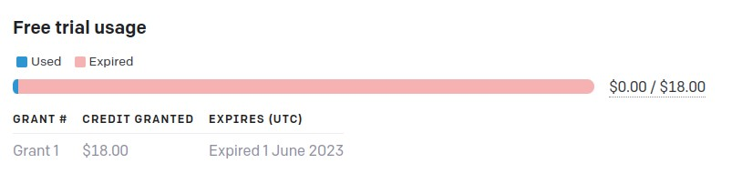

    - Check your API key usage <a href="https://platform.openai.com/account/usage" target="_blank">here</a>

<br>

- **Creating Open AI Account with New Mail and New Phone Number:**

    - Open <a href="https://openai.com/" target="_blank">https://openai.com</a>

    - Click on `Sign Up` button

    - Choose your preffered Sign Up method

    - After logged in click <a href="https://platform.openai.com/apps" target="_blank">here</a> to see below options

        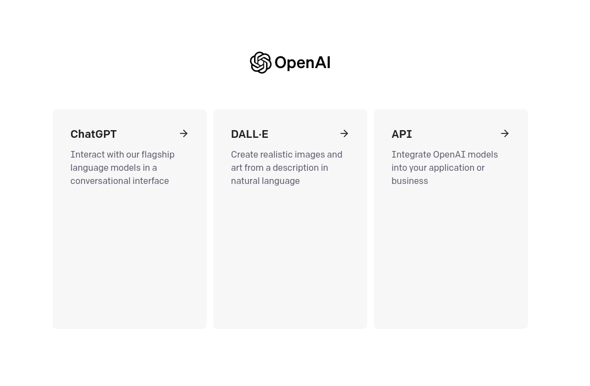

- **Create a Hugging Face Account**
    
    - Open [https://huggingface.co/](https://huggingface.co/)

    - Click on `Sign Up` button

    - Enter your details and Click on `Sign Up` button

    - Verify your email address

- **Create a New Space in Hugging Face Account**
    
    - Click on Profile icon top right

        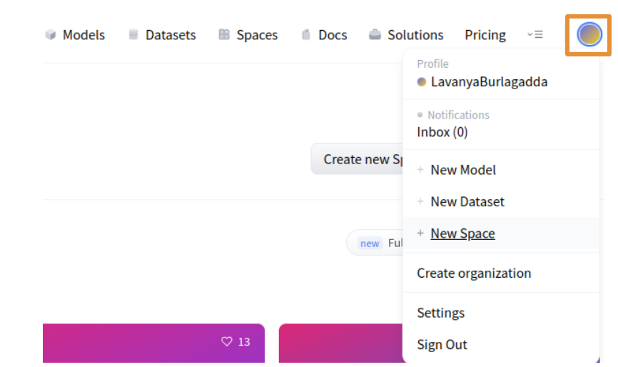
    
    - Click on `New Space`

        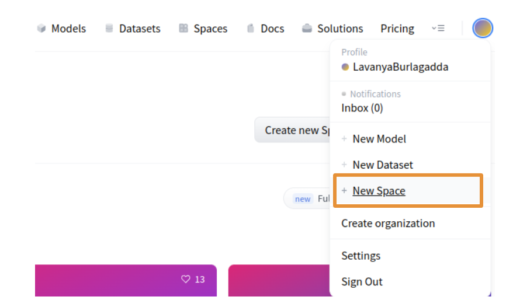

    - Enter below details of your new space

        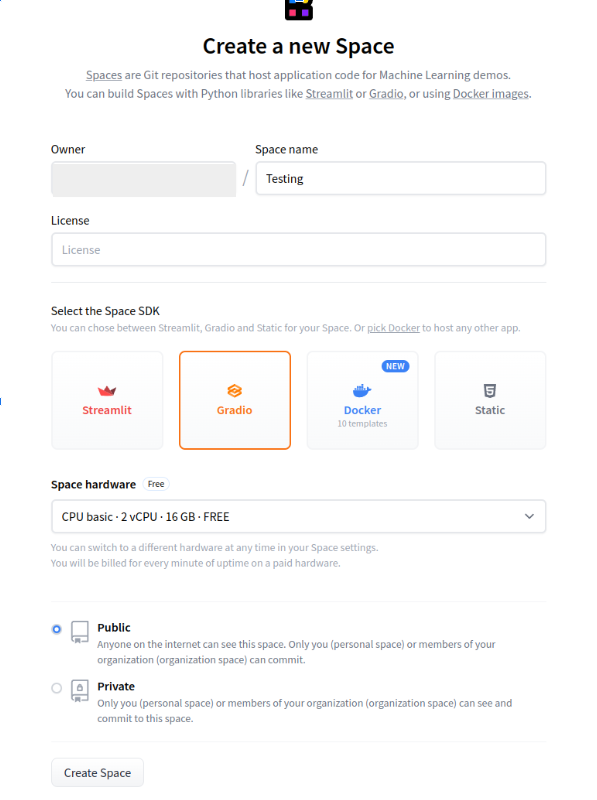

- **Open the below provided Colab link**

    <a href="https://colab.research.google.com/drive/1miK4Xbqv9lYkfe0z6jMh41fA_itulAA0?usp=sharing" target="_blank"></a>


- **Copying Code to your Google Drive**

    - On the top left corner of Google Colab Notebook you can find `File`, click on it

        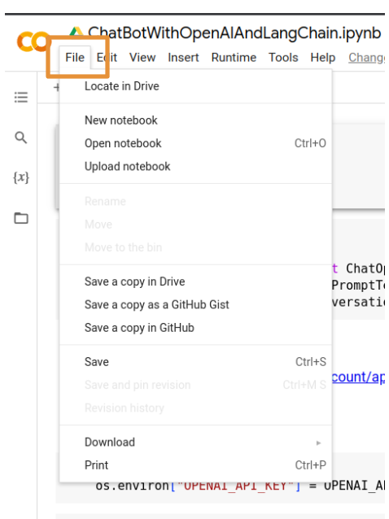

    - Click on `Save a copy in Drive`

        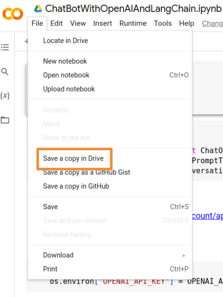
    
    - If you are not logged in to your Google Account, please log into it.

    - Once you are successfully logged in a new Google Colab Notebook with the given code will be opened
</details>

- **Click on the Play button to Install the Packages**

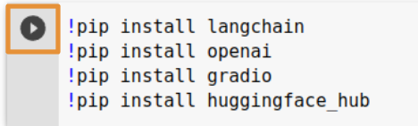

- **Click on the Play button to import the required things to build the application**

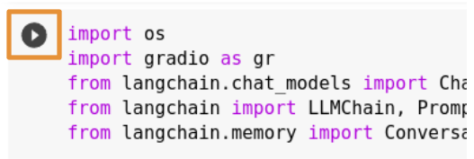

- **Get the Open AI API Key and set it as environmental variable

    - Generate API Key

        -  Go to <a href="https://platform.openai.com/account/api-keys" target="_blank">https://platform.openai.com/account/api-keys</a>

        - Click on `+ Create new secret key`

        - Copy the Secret Key for your use

    - Replace your `OPENAI_API_KEY` with your own API Key

        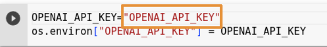

    - Click on the Play button

        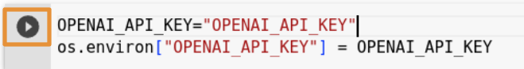

- **Assigning the values for template, prompt, and memory**

    - You can update the first line of the template with <a href="#" target="_blank">Prompts and Examples</a> provided

    - Click on the Play button

        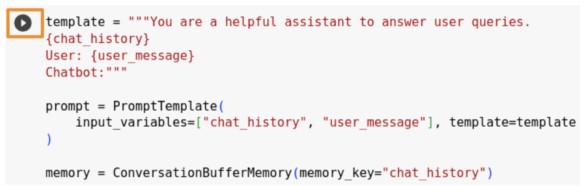

- **Initializing LLM Chain using OpenAI**

    - Using `ChatOpenAI` method we are creating an <a href="https://js.langchain.com/docs/api/chains/classes/LLMChain" target="_blank">LLM Chain</a>

    - Click on the Play button

        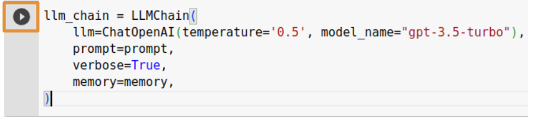

- **Define a function to generate the response for the question you ask**

    - From the initialized `llm_chain` we will predict the response

    - Click on the Play button

        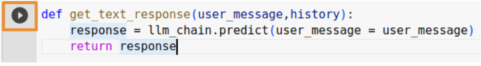

- **Create a Chat Interface using Gradio**

    - We are creating the `ChatInterface` from gradio and providing a function `get_text_response` and also examples from <a href="#" target="_blank">Prompts and Examples</a> provided

    - Check for other arguments <a href="https://www.gradio.app/docs/chatinterface" target="_blank">here</a>

    - Click on the Play button to create an interface

        

- **Launch your ChatBot with Gradio App**

    - Click on the Play button to launch the App

        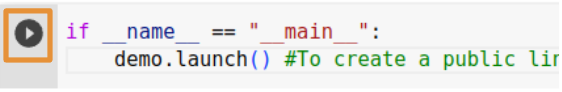

- **Now you can try asking questions in your ChatBot**

- **If you are getting any errors**

    -  Keep print statements to identify the issue

    - To identify the error you are getting please add `debug = True` while launching the gradio app

        ```python
        if __name__ == "__main__":
            demo.launch(debug = True)
        ```

        ```python
        def get_text_response(user_message,history):
        try:
            response = llm_chain.predict(user_message = user_message)
        except Exception as e:
            print("Error:", e)
            try:
                print("Error:", e.error.message)
                response = "Failed to reply: " + e.error.message
            except Exception as e:
                response = "Failed to reply"
        return response
        ```